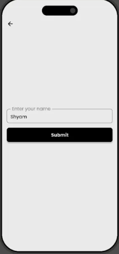

# DEMO

## ✅ Completed Features

### 1️⃣ Name Input Navigation

- Users must navigate to the next screen to enter their name.
- The **'Hi'** button is tappable and navigates to the name input screen.

 

---

### 2️⃣ Submit Button Logic

- The **Submit** button remains **disabled** until the user enters text in the input field.
- On pressing **'Submit'**, the app returns to the previous screen with the entered name.

 

 

---

### 3️⃣ Dynamic Button Enablement

- The **increment** and **decrement** buttons are initially **disabled**.
- These buttons become **enabled** once a valid name is entered and returned from the name screen.

---

### 4️⃣ User Name Display

- The user's entered name is correctly displayed on the main screen after submission.

 

---

## 🛠 Getting Started

1. **Clone the Repository**:  
```bash
git clone https://github.com/rohan-165/Demo.git
cd Demo
```


## 📦 Download APK

You can download and try the demo app here:

➡️ [Download demo_app.apk](https://github.com/rohan-165/Demo/raw/main/screenshots/Demo-app-release.zip)

> Note: If download doesn't start automatically, right-click and choose "Save link as..."

